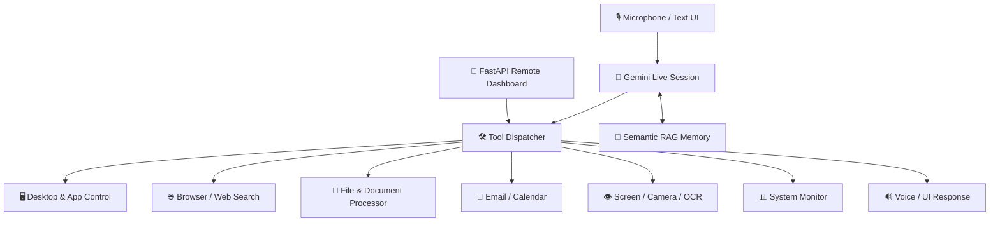

<div align="center">

# 🤖 NextGen AI Assistant — ULTRON

### Real-Time Gemini Voice Assistant, Desktop Automation, Semantic Memory & Remote Control Dashboard

**NextGen AI Assistant** is a Python desktop assistant built around a PyQt interface and Gemini's realtime audio capabilities. The application combines voice interaction, tool execution, semantic RAG memory, screen/camera understanding, browser and desktop control, file processing, system monitoring, reminders, email/calendar actions, and an optional FastAPI-powered remote dashboard.

<p align="center">
  
  
  
  
  
</p>

</div>

---

## 🏛️ Assistant Architecture



## ✨ Capability Map

| Area | Included Tools |
|---|---|
| 🎙️ Realtime Assistant | Gemini live audio, microphone streaming and text commands |
| 🧠 Memory | Persistent memory manager + semantic retrieval with FastEmbed |
| 🖥️ Computer Control | App launching, desktop control, settings and automation |
| 🌐 Web | Browser automation, Playwright, search, news and YouTube transcript support |
| 👁️ Vision | Screen capture, camera capture and offline OCR |
| 📁 Files | PDF, DOCX, spreadsheet, presentation and audio processing utilities |
| 📊 System | CPU/GPU/system telemetry and proactive monitoring |
| 📅 Productivity | Reminders, task scheduling, Gmail-style email actions and Google Calendar integration |
| 📱 Remote | FastAPI/Uvicorn dashboard and generated remote access keys |

## 🚀 Installation

### 1. Clone and create a virtual environment

```bash
git clone https://github.com/shreeharsh-patil/NextGenAi-Assistant.git
cd NextGenAi-Assistant
python -m venv .venv
```

Activate it, then install dependencies:

```bash
pip install -r requirements.txt
```

### 2. Configure Gemini

Create or update `config/api_keys.json`:

```json
{
  "gemini_api_key": "YOUR_GEMINI_API_KEY"
}
```

### 3. Start the assistant

```bash
python main.py
```

> [!IMPORTANT]
> This application can perform real desktop, browser, file, messaging, and system actions. Review configured permissions and API credentials before enabling automation on a machine containing important data.

## 📁 Repository Architecture

```text
NextGenAi-Assistant/
├─ actions/                 # Desktop, browser, file, vision and productivity tools
├─ config/                  # API and runtime configuration
├─ core/                    # Prompt, tool declarations and assistant core
├─ memory/                  # Persistent memory, RAG and task scheduling
├─ utils/                   # Logging and shared helpers
├─ main.py                  # Realtime assistant entry point
├─ ui.py                    # PyQt desktop interfaces
├─ requirements.txt         # Python dependencies
└─ README.md                # Project documentation
```

## 🖥️ Platform Notes

The requirements include several Windows-specific integrations for audio, notifications, UI automation and telemetry. Cross-platform components can still be used elsewhere, but the fullest desktop-control feature set is designed around Windows.

## 👤 Project Author

Developed and maintained by **Shreeharsh Patil**.

- **Email:** shreeharsh.dev@gmail.com
- **GitHub:** [github.com/shreeharsh-patil](https://github.com/shreeharsh-patil)
